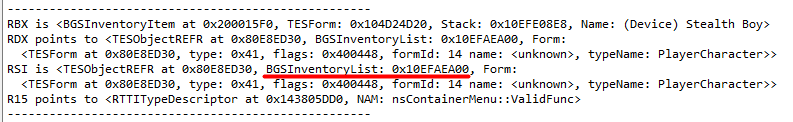
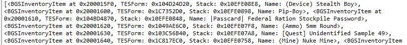
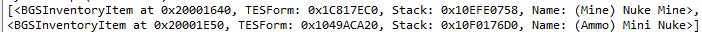
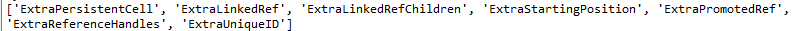
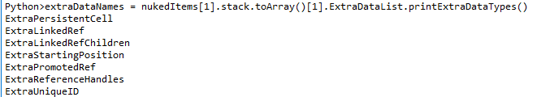
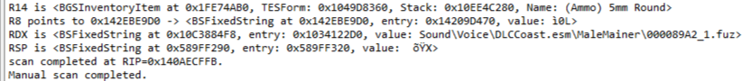

# IDAPython Debugging Dynamic Enrichment (DDE) + Fallout 4 Helpers

## Basic use-case scenario:
1. Clone the repository
2. Start debugging session in IDA
3. Press Alt+F7 or go to File->"Script file..."
4. Select `debugger_dynamic_enrichment.py` and press "OK"

It will install the debugger hook. Now, each time the breakpoint be hit (or "step into"/"step over"/"run to") additional info about data in registers will be printed to the debug output window if found.

If you know a data structure's address (e.g. TESForm) in Fallout 4 then you can inspect it by creating a TESForm (or any other, available in tesobjects.py) object and passing an address to the constructor:
````python
TESForm(0x000000000)
````

But to make TES objects available run `tesobjects.py` at least once.

Known limitations:
1. Works only on x64 platforms and only helpful with MSVC++
2. Very limited support of Fallout 4

## Quick Start Guide

### Advanced usage of TESObjects

Let's consider the following example: you've loaded `debugger_dynamic_enrichment.py`, added a breakpoint to a sub_xxx, and that breakpoint hit.
And assume, that sub_xxx uses some known TES objects from `tesobjects.py`. In that case you may see something like that:



We can see that RSI register points to `TESObjectREFR` and it has `BGSInventoryList` at address 0x10EFAEA00.

> Notice:
> TESObjectREFR has inventory list but you only see an address where it is located in memory. When you click on this address
> you'll jump to that address in IDA. Sometimes it's useful but you can do much more.

Now, let's say you'd like to see which items are in this inventory. The easiest way is to create BGSInventoryList object and assign its items
to, let's say, `items` variable. The following IDAPython commands will do the trick:

`````python
items = BGSInventoryList(0x10EFAEA00).Items.Entries
repr(items)
`````


You'll see something like that:



> Notice 1: at that point be sure that you ran `tesobject.py` (File > Script file...). If you dont then you'll see an exception saying 
> "NameError: name 'BGSInventoryList' is not defined.

> Notice 2: For now the API of tesobject is not very consistent, so you may open `tesobject.py` and use it as a reference. For example, if you
> don't know what you can do with `BGSInventoryList` object, just open `tesobject.py`, search for "BGSInventoryItem" and see which properties and
> methods it has. You can call each one for getting an additional output.

> Notice 3: You can omit `repr` and just enter `items` after the assignment. The output will be the same.

> Notice 4: In order to understand what the first line does and why we didn't used `BGSInventoryList` directly you may take a look at
its implementation in `tesobjects.py`. In two words, property `Items` of BGSInventoryList is `tArray` which is object and it's not iterable.
But we can access `Entries` property of `tArray` which is array of `BGSInventoryItem`.

But the most useful part comes when you want to find a particular item or group of items. For example, you'd like to get only items that
have "nuke" in their names. In that case the following commands will do the trick:

`````python
items = BGSInventoryList(0x10EFAEA00).Items.Entries
nukedItems = [item for item in items if "nuke" in item.name.lower()]
repr(nukedItems)
`````

If the inventory list contains those items (like mine) you'll see an output similar to that:



Now, let's say, you'd like to see which types of extra data "Mini Nuke" has. In that case you can access the second item in 
"nukedItems" list and then get all extra data names using the following commands:

`````python
items = BGSInventoryList(0x10EFAEA00).Items.Entries
nukedItems = [item for item in items if "nuke" in item.name.lower()]
stacksWithExtraData = [stack for stack in nukedItems[1].stack.toArray() if stack.hasExtraDataList()]
extraDataNames = [name for names in [stack.ExtraDataList.getExtraDataTypeNames() for stack in stacksWithExtraData] for name in names]
repr(extraDataNames)
`````

Which will print all extra data type names in all stacks beloning to "Mini Nuke":



It's much simpler to print extra data names for a particular stack. For example, we can print
extra data type names for the second stack of "Mini Nuke" by running the following commands:

`````python
items = BGSInventoryList(0x10EFAEA00).Items.Entries
nukedItems = [item for item in items if "nuke" in item.name.lower()]
extraDataNames = nukedItems[1].stack.toArray()[1].ExtraDataList.printExtraDataTypes()
`````

And the ouput will look like:



## Analysis Examples

### Function Analysis Examples


### TES Objects Analysis Examples

BSFixedString:



## Scripts description

### vftable_renamer.py

This simple script can be used for renaming a range of subs with default names in vftable.

Usage:
1. Select a range of subs, run the script
2. Enter a prefix that will be added to selected subs (e.g. "MyClass::") in a popup
3. Press "Enter"

Subs with default names will be renamed into "MyClass::sub_xxxxxxxx"

### hightlight_local_calls.py

This simple script can be used for highlighting local calls inside a currently opened function.
Much more powerful alternatives exist on the internet but they often run for too long for big executables.
